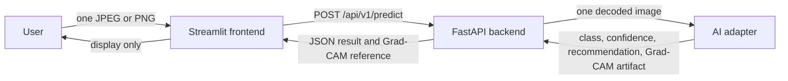

# Architecture

## System context

SteelGuard AI uses a deliberately small three-boundary architecture for the
preliminary MVP.

## Boundary responsibilities

### Frontend

- Own the one-image interaction, preview, loading, error, result, and reset
  states.
- Perform non-authoritative usability validation before upload.
- Make one synchronous prediction request through the API client boundary.
- Treat prediction fields as immutable display data.
- Resolve and render the backend-provided Grad-CAM resource.

The frontend must not contain model code, label scoring, confidence thresholds,
recommendation rules, or heatmap generation.

### Backend

- Own the public HTTP contract and authoritative request validation.
- Decode one image and call the AI adapter once.
- Validate and serialize the adapter result.
- Expose a retrievable Grad-CAM reference.
- Map known failures to stable HTTP statuses and safe messages.

The backend must not return a fabricated fallback prediction when inference
fails. It also must not grow persistence, history, batch, or background-job
capabilities for the preliminary MVP.

### AI subsystem

- Own preprocessing and model lifecycle.
- Own label-index mapping and confidence output.
- Generate a Grad-CAM artifact for the same inference.
- Own the ACCEPT/REWORK/REJECT recommendation policy.
- Expose a framework-independent single-image adapter to the backend.

## Data flow

1. The user selects one supported image in Streamlit.
2. The frontend decodes it for preview and local validation only.
3. On Analyze, the API client sends the original selected file in the `image`
   multipart field.
4. FastAPI validates and decodes the request, then invokes the AI adapter.
5. The adapter returns a single logical prediction and Grad-CAM artifact.
6. FastAPI makes the artifact retrievable and returns the JSON response.
7. Streamlit renders the returned values and provides a reset action.

No database is required in this flow. User images, results, and Grad-CAM output
must not become inspection history. If the backend uses temporary artifacts to
serve Grad-CAM, their lifecycle must remain request/demo infrastructure rather
than a persistent product feature.

## Runtime and deployment foundation

- The frontend runs on Streamlit port `8501`.
- The future backend will run as a separate FastAPI process and container.
- The AI adapter will execute inside, or be imported by, the backend process for
  the preliminary MVP; it is not a network microservice.
- Docker Compose currently defines only the runnable frontend. The backend
  service is added after its application and Dockerfile exist.
- The frontend API base URL will be configured by environment during the
  integration phase rather than hard-coded into UI components.

## Failure boundaries

- Invalid selections are reported before Analyze where possible, then checked
  again by FastAPI.
- Network, timeout, non-JSON, and non-success responses remain API-client
  failures; UI components receive a normalized success or error state.
- Model failures remain backend errors and never become zero-confidence or
  default-class results.
- An unavailable Grad-CAM makes the prediction response invalid; the backend
  should return an error rather than omit an expected output silently.

## Sources of truth

- Product scope: [`FEATURES.md`](FEATURES.md)
- HTTP interface: [`API_CONTRACT.md`](API_CONTRACT.md)
- UI behavior: [`UI_FLOW.md`](UI_FLOW.md)
- Frontend module ownership: [`FRONTEND_SPEC.md`](FRONTEND_SPEC.md)
