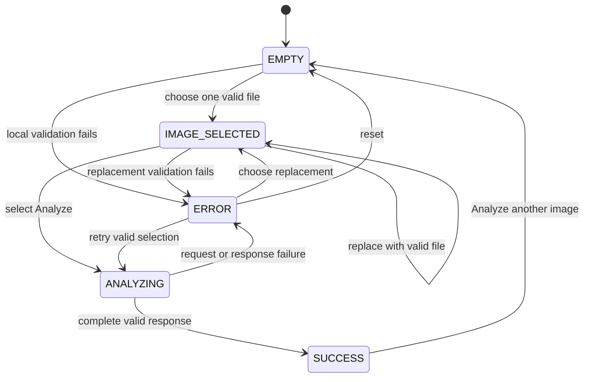

# SteelGuard AI Frontend Specification

> **Project:** SteelGuard AI — Intelligent Steel Surface Defect Detection for Smart Manufacturing
>
> **Frontend:** Python, Streamlit, Requests or HTTPX, Pillow, and custom CSS
>
> **Repository status:** The mock-driven preliminary frontend MVP is implemented. Live FastAPI integration remains planned.

The frontend is a presentation client. It owns user interaction, current-page
state, HTTP orchestration, and display of backend AI results. It does not own
image classification, confidence calculation, Grad-CAM generation, or the
quality recommendation.

The complete preliminary frontend workflow is:

```text
EMPTY
→ IMAGE SELECTED
→ ANALYZING
→ SUCCESS or ERROR
```

Exactly one image may be selected and analyzed per inference.

## Feature priority labels

Every normative frontend feature in this specification uses one of these
labels:

| Label | Meaning |
| --- | --- |
| **MUST HAVE** | Required for the preliminary MVP and blocks frontend completion |
| **SHOULD HAVE** | Strongly preferred for usability or maintainability; a deferral requires a documented reason |
| **OPTIONAL** | May be added if the MVP is already complete and the feature does not expand scope |
| **OUT OF SCOPE** | Prohibited from the preliminary MVP and reserved for future development |

Explanatory text is not a feature. When a table or list defines behavior, each
row or item carries its applicable label.

## 1. Frontend Responsibilities

**Section priority: MUST HAVE**

| Priority | Responsibility |
| --- | --- |
| **MUST HAVE** | Render one focused Streamlit page for one-image inspection. |
| **MUST HAVE** | Accept one JPG, JPEG, or PNG file and provide early client-side validation. |
| **MUST HAVE** | Preview the selected image without altering the original bytes submitted to the backend. |
| **MUST HAVE** | Manage the `EMPTY`, `IMAGE_SELECTED`, `ANALYZING`, `SUCCESS`, and `ERROR` states for the current interaction. |
| **MUST HAVE** | Submit exactly one image in one request to the configured backend prediction endpoint. |
| **MUST HAVE** | Validate the success response and display the backend-supplied defect class, confidence, Grad-CAM, and recommendation. |
| **MUST HAVE** | Normalize recoverable frontend and API failures into concise, user-safe messages. |
| **MUST HAVE** | Reset all request-specific state before another image is analyzed. |
| **SHOULD HAVE** | Keep presentation components independent of networking and keep the API client independent of Streamlit rendering. |
| **SHOULD HAVE** | Apply the existing industrial visual language through narrowly scoped custom CSS. |
| **OUT OF SCOPE** | Run model inference, map class indices, calculate confidence, generate Grad-CAM, or choose a recommendation in the frontend. |
| **OUT OF SCOPE** | Persist images or results as inspection history or analytics data. |

The frontend may format data for display, such as converting a `0.942`
confidence value to `94.2%`. Formatting must not change the underlying meaning
or create a replacement result.

## 2. Page Structure

**Section priority: MUST HAVE**

The application uses a centered, single-purpose page rather than dashboard
navigation.

| Order | Page region | Visible behavior | Priority |
| --- | --- | --- | --- |
| 1 | Header | Product name and a short description of single-image steel defect inspection | **MUST HAVE** |
| 2 | Instruction | Supported formats and a clear prompt to choose one steel surface image | **MUST HAVE** |
| 3 | Upload section | Single-file uploader and local validation feedback | **MUST HAVE** |
| 4 | Preview section | Selected-image preview and non-inference file details | **MUST HAVE** |
| 5 | Action section | Analyze button or analysis status | **MUST HAVE** |
| 6 | Outcome section | Prediction result card or recoverable error message | **MUST HAVE** |
| 7 | Reset section | Analyze another image action after success and when recovery requires replacement | **MUST HAVE** |
| 8 | Short explanation | Plain-language note that Grad-CAM is a model explanation | **SHOULD HAVE** |
| 9 | Footer | Compact project or competition attribution with no additional navigation | **OPTIONAL** |
| — | Sidebar or dashboard shell | Multi-page navigation, account controls, analytics, or history | **OUT OF SCOPE** |

The result section must not appear before a complete, contract-valid response
exists. Previous results must not remain visible after a new image is selected.

## 3. Component Structure

**Section priority: MUST HAVE**

Use the existing module boundaries rather than placing all UI, networking, and
validation logic in `app.py`.

| Module | Responsibility | Priority |
| --- | --- | --- |
| `frontend/app.py` | Configure the page, initialize current-interaction state, coordinate transitions, and compose components | **MUST HAVE** |
| `frontend/components/upload_section.py` | Render one-file upload controls and return the current selection | **MUST HAVE** |
| `frontend/components/image_preview.py` | Render the validated preview and safe file metadata | **MUST HAVE** |
| `frontend/components/result_card.py` | Compose all fields from one validated prediction result | **MUST HAVE** |
| `frontend/components/confidence.py` | Format and render the backend confidence without applying a decision threshold | **MUST HAVE** |
| `frontend/components/recommendation.py` | Render the exact backend recommendation with accessible visual status | **MUST HAVE** |
| `frontend/components/gradcam_view.py` | Decode or retrieve, label, and display the confirmed backend Grad-CAM representation | **MUST HAVE** |
| `frontend/services/api_client.py` | Submit the multipart request, enforce timeout/status behavior, validate the response, and normalize client errors | **MUST HAVE** |
| `frontend/utils/image_validator.py` | Perform non-authoritative local file and Pillow decoding checks | **MUST HAVE** |
| `frontend/styles/main.css` | Define project-owned visual tokens and minimal Streamlit overrides | **SHOULD HAVE** |

| Architectural rule | Priority |
| --- | --- |
| Components receive values through parameters and do not call the backend directly. | **MUST HAVE** |
| The API client returns normalized data or a normalized client error and does not render Streamlit elements. | **MUST HAVE** |
| Image validation does not inspect pixels for a defect or make an AI decision. | **MUST HAVE** |
| Custom CSS uses project-owned classes or stable selectors where possible and avoids broad changes to all Streamlit controls. | **SHOULD HAVE** |

## 4. UI States

**Section priority: MUST HAVE**



| State | Required data | Visible UI | Permitted actions | Priority |
| --- | --- | --- | --- | --- |
| `EMPTY` | No selected image, result, or error | Header, instructions, empty uploader | Select one file | **MUST HAVE** |
| `IMAGE_SELECTED` | Original bytes, validated preview, and safe metadata | Preview and enabled Analyze button | Analyze, replace, or remove image | **MUST HAVE** |
| `ANALYZING` | Valid selection and request-in-progress state | Preview, disabled duplicate actions, loading status | Wait only | **MUST HAVE** |
| `SUCCESS` | Complete validated prediction and displayable Grad-CAM representation | Preview, all result fields, reset action | Analyze another image | **MUST HAVE** |
| `ERROR` | Normalized error and recovery context | Concise error, preview when still valid, recovery actions | Retry, replace, or reset as applicable | **MUST HAVE** |

Streamlit session state stores only the current interaction. At minimum it
must distinguish the current phase, uploader instance, original file bytes,
preview data, normalized result, and normalized error. The phase is the source
of truth for button availability; a second independent `is_loading` flag must
not be allowed to contradict it.

| State rule | Priority |
| --- | --- |
| A newly selected file clears any previous result and error before validation. | **MUST HAVE** |
| `IMAGE_SELECTED` is entered only after local validation passes and is the only normal state that enables Analyze. | **MUST HAVE** |
| `SUCCESS` is entered only when all required response fields pass validation. | **MUST HAVE** |
| A retryable API error preserves the valid selection; an invalid-file error requires replacement or reset. | **MUST HAVE** |
| Images and results from earlier interactions are not retained after reset. | **MUST HAVE** |

## 5. Image Upload Specification

**Section priority: MUST HAVE**

| Requirement | Priority |
| --- | --- |
| Use a Streamlit file uploader configured for `jpg`, `jpeg`, and `png`. | **MUST HAVE** |
| Set multiple-file acceptance to false; the uploader returns at most one file. | **MUST HAVE** |
| Label the control explicitly, for example, “Upload one steel surface image.” | **MUST HAVE** |
| State the supported formats next to the control. | **MUST HAVE** |
| Read and retain the original selected bytes for the eventual multipart request. | **MUST HAVE** |
| Move to `IMAGE_SELECTED` when the uploader value changes and clear stale output immediately. | **MUST HAVE** |
| Do not start analysis automatically after selection. | **MUST HAVE** |
| Apply the same maximum size as the backend after that shared limit is confirmed in the project decision register. | **MUST HAVE** |
| Show filename, image dimensions, and human-readable file size after validation. | **SHOULD HAVE** |
| Drag-and-drop behavior supplied by Streamlit may remain available when it still enforces one file. | **OPTIONAL** |
| Batch upload or a multi-select uploader is prohibited. | **OUT OF SCOPE** |

Allowed filename extensions and corresponding content types are:

| Extension | Expected decoded format | API media type | Priority |
| --- | --- | --- | --- |
| `.jpg` | JPEG | `image/jpeg` | **MUST HAVE** |
| `.jpeg` | JPEG | `image/jpeg` | **MUST HAVE** |
| `.png` | PNG | `image/png` | **MUST HAVE** |

An extension or browser-supplied media type alone is insufficient. Pillow must
also verify the selected bytes, and the backend must repeat authoritative
validation.

## 6. Image Preview Specification

**Section priority: MUST HAVE**

| Requirement | Priority |
| --- | --- |
| Decode the selected bytes with Pillow before entering `IMAGE_SELECTED`. | **MUST HAVE** |
| Apply EXIF orientation correction to the preview representation where applicable. | **MUST HAVE** |
| Keep original upload bytes unchanged for the API request. | **MUST HAVE** |
| Fit the preview within its container without stretching or changing aspect ratio. | **MUST HAVE** |
| Provide meaningful visible caption text containing the filename or “Selected steel surface image.” | **MUST HAVE** |
| Display safe metadata such as dimensions and file size without exposing local paths. | **SHOULD HAVE** |
| Use a neutral image background or border when needed for visual separation. | **SHOULD HAVE** |
| Provide a preview expansion control only if it remains keyboard accessible and does not introduce another workflow. | **OPTIONAL** |
| Add detection boxes, segmentation masks, inferred labels, or frontend-generated heatmaps to the source preview. | **OUT OF SCOPE** |

The preview is an orientation-corrected presentation view. It is not model
preprocessing and must not be used as a replacement for the original upload
unless the backend contract is deliberately changed.

## 7. Analyze Button Behavior

**Section priority: MUST HAVE**

| Requirement | Priority |
| --- | --- |
| Show one primary button labeled **Analyze image**. | **MUST HAVE** |
| Disable the button in `EMPTY`, `IMAGE_SELECTED`, and `ANALYZING`. | **MUST HAVE** |
| Enable the button only in `IMAGE_SELECTED` and for a retryable `ERROR` with a still-valid selection. | **MUST HAVE** |
| One deliberate button activation creates exactly one prediction request. | **MUST HAVE** |
| Transition to `ANALYZING` before invoking the API client so a rerun cannot create a duplicate submission. | **MUST HAVE** |
| Clear an earlier error when a deliberate retry starts. | **MUST HAVE** |
| On success, store only the normalized result and transition to `SUCCESS`. | **MUST HAVE** |
| On failure, store a normalized error and transition to `ERROR`. | **MUST HAVE** |
| Do not automatically retry the prediction POST because that could cause more than one inference for one user action. | **MUST HAVE** |
| A keyboard user can focus and activate the button using standard Streamlit behavior. | **MUST HAVE** |
| Analyze automatically on file selection. | **OUT OF SCOPE** |

## 8. Loading State

**Section priority: MUST HAVE**

| Requirement | Priority |
| --- | --- |
| Keep the validated preview visible while analysis is running. | **MUST HAVE** |
| Show an explicit status such as “Analyzing image…” using a Streamlit spinner or status element. | **MUST HAVE** |
| Disable Analyze, replacement, and reset actions until the request returns. | **MUST HAVE** |
| Prevent a second request from the same interaction while in `ANALYZING`. | **MUST HAVE** |
| Replace the loading status with either the complete result or a recoverable error. | **MUST HAVE** |
| Avoid a numeric progress percentage when the backend does not report real progress. | **MUST HAVE** |
| Include a short expectation-setting message without promising a completion time. | **SHOULD HAVE** |
| Use decorative animation beyond the standard Streamlit status treatment. | **OPTIONAL** |

## 9. Prediction Result Layout

**Section priority: MUST HAVE**

The result must be presented as one coherent response, in this order:

| Order | Result element | Priority |
| --- | --- | --- |
| 1 | “Analysis result” heading | **MUST HAVE** |
| 2 | Defect class as the primary textual result | **MUST HAVE** |
| 3 | Confidence score with an accessible numeric label | **MUST HAVE** |
| 4 | `ACCEPT`, `REWORK`, or `REJECT` recommendation | **MUST HAVE** |
| 5 | Grad-CAM model explanation | **MUST HAVE** |
| 6 | Analyze another image action | **MUST HAVE** |
| 7 | Small explanatory text for confidence and Grad-CAM | **SHOULD HAVE** |

| Layout rule | Priority |
| --- | --- |
| All displayed inference fields come from one validated backend response. | **MUST HAVE** |
| Do not render a partial success card when a required field is missing or invalid. | **MUST HAVE** |
| Visually group class, confidence, and recommendation without making color the only signal. | **MUST HAVE** |
| On wider screens, source preview and Grad-CAM may use balanced columns; they stack on narrow screens. | **SHOULD HAVE** |
| Add charts, trends, aggregate counts, or comparisons with earlier predictions. | **OUT OF SCOPE** |

## 10. Defect Class Display

**Section priority: MUST HAVE**

The API client accepts only these exact, case-sensitive backend values:

| Supported defect class | Priority |
| --- | --- |
| `Crazing` | **MUST HAVE** |
| `Inclusion` | **MUST HAVE** |
| `Patches` | **MUST HAVE** |
| `Pitted Surface` | **MUST HAVE** |
| `Rolled-in Scale` | **MUST HAVE** |
| `Scratches` | **MUST HAVE** |

| Display rule | Priority |
| --- | --- |
| Render the exact returned class as the most prominent result text. | **MUST HAVE** |
| Reject an unsupported, missing, empty, or differently cased value as a contract error. | **MUST HAVE** |
| Use a visible label such as “Detected defect.” | **MUST HAVE** |
| Add a short static description of each class only if it is reviewed by the AI/domain owner and does not imply severity. | **OPTIONAL** |
| Rename, merge, infer, or rank classes in the frontend. | **OUT OF SCOPE** |

## 11. Confidence Score Display

**Section priority: MUST HAVE**

| Requirement | Priority |
| --- | --- |
| Accept only a finite numeric backend value in the inclusive range `0.0` to `1.0`; booleans are not valid numbers for this field. | **MUST HAVE** |
| Convert the value to a percentage for presentation without changing the stored normalized value. | **MUST HAVE** |
| Show the percentage as text, with enough precision to avoid presenting false exactness. | **MUST HAVE** |
| Label the value “Model confidence” rather than “Accuracy.” | **MUST HAVE** |
| Avoid using a frontend confidence threshold to change the class or recommendation. | **MUST HAVE** |
| Add helper text that confidence is the model's score for this prediction, not a guarantee. | **SHOULD HAVE** |
| Include a progress bar only when the numeric text remains visible and the bar has no pass/fail threshold semantics. | **OPTIONAL** |
| Display model accuracy, dataset statistics, or unprovided probabilities for other classes. | **OUT OF SCOPE** |

## 12. Grad-CAM Display

**Section priority: MUST HAVE**

| Requirement | Priority |
| --- | --- |
| Read a non-empty `prediction.gradcam_image` string from the backend response. | **MUST HAVE** |
| Decode a base64 PNG data URI or retrieve an image reference according to the transport option confirmed in the API contract. | **MUST HAVE** |
| Display the image under a heading such as “Grad-CAM model explanation.” | **MUST HAVE** |
| Preserve the image aspect ratio and fit it within the result container. | **MUST HAVE** |
| Provide a visible caption explaining that highlighted regions influenced the model prediction. | **MUST HAVE** |
| State that Grad-CAM is not a segmentation mask or precise defect boundary. | **MUST HAVE** |
| Treat a missing, malformed, or undisplayable required Grad-CAM representation as an error; do not fabricate a heatmap. | **MUST HAVE** |
| Place the original preview and Grad-CAM side by side on sufficiently wide layouts. | **SHOULD HAVE** |
| Offer an accessible enlarge control if supported without custom interaction complexity. | **OPTIONAL** |
| Generate or modify Grad-CAM pixels in the frontend. | **OUT OF SCOPE** |

## 13. Accept/Rework/Reject Display

**Section priority: MUST HAVE**

| Backend value | Required text | Suggested visual treatment | Priority |
| --- | --- | --- | --- |
| `ACCEPT` | ACCEPT | Positive/green status with text | **MUST HAVE** |
| `REWORK` | REWORK | Caution/amber status with text | **MUST HAVE** |
| `REJECT` | REJECT | Critical/red status with text | **MUST HAVE** |

| Display rule | Priority |
| --- | --- |
| Validate the recommendation against the three exact uppercase values. | **MUST HAVE** |
| Display the returned value prominently with a visible “Recommendation” label. | **MUST HAVE** |
| Pair color with text and, where useful, an icon so meaning never depends on color alone. | **MUST HAVE** |
| Keep visual styling consistent across reruns and viewport sizes. | **SHOULD HAVE** |
| Add static wording that the result is AI-assisted decision support. | **SHOULD HAVE** |
| Show backend-provided explanatory text if the API contract is later extended compatibly. | **OPTIONAL** |
| Derive a recommendation from class, confidence, a frontend lookup table, or a threshold. | **OUT OF SCOPE** |

## 14. Error States

**Section priority: MUST HAVE**

| Error condition | User-facing behavior | Recovery | Priority |
| --- | --- | --- | --- |
| No file selected | Keep Analyze disabled; no alarming error is needed | Select a file | **MUST HAVE** |
| Unsupported extension or decoded format | “Choose a JPG, JPEG, or PNG image.” | Replace selection | **MUST HAVE** |
| Empty or unreadable/corrupt file | “This image could not be read. Choose another image.” | Replace selection | **MUST HAVE** |
| Confirmed size limit exceeded | Explain the shared limit without attempting upload | Replace selection | **MUST HAVE** |
| Backend connection failure | Explain that the analysis service could not be reached | Retry or replace | **MUST HAVE** |
| Request timeout | Explain that analysis did not complete in time | Deliberate retry or replace | **MUST HAVE** |
| `400`, `415`, or `422` response | Present a concise validation message consistent with the API contract | Replace or retry when appropriate | **MUST HAVE** |
| `500` response | Explain that analysis failed without exposing internals | Retry or replace | **MUST HAVE** |
| `503` response | Explain that the analysis service/model is temporarily unavailable | Retry later or replace | **MUST HAVE** |
| Non-JSON or contract-invalid success body | Treat as an invalid service response; show no result | Retry or report during development | **MUST HAVE** |
| Grad-CAM cannot be resolved or displayed | Do not fabricate or silently omit the required explanation | Retry or replace | **MUST HAVE** |
| Unexpected frontend exception | Show a generic safe message and return to a recoverable state | Reset or retry if valid | **MUST HAVE** |
| Technical detail panel for local development | Show sanitized diagnostics only in an explicitly enabled development mode | Developer action | **OPTIONAL** |

No error state may expose a stack trace, local filesystem path, secret,
framework tensor, model path, or raw exception text to the operator.

## 15. Reset/Analyze Another Image

**Section priority: MUST HAVE**

| Requirement | Priority |
| --- | --- |
| Show **Analyze another image** after `SUCCESS`. | **MUST HAVE** |
| Offer reset or replacement when an `ERROR` cannot be retried with the current selection. | **MUST HAVE** |
| Clear original bytes, preview, metadata, normalized result, normalized error, and current phase. | **MUST HAVE** |
| Return to `EMPTY` and show a fresh uploader. | **MUST HAVE** |
| Change the Streamlit uploader widget key or its nonce when needed to clear the browser-side selection reliably. | **MUST HAVE** |
| Trigger one controlled rerun after state is cleared. | **MUST HAVE** |
| Ensure no previous class, confidence, recommendation, or Grad-CAM flashes during the next interaction. | **MUST HAVE** |
| Preserve the current valid image for a deliberate retry after a recoverable API error. | **MUST HAVE** |
| Save the previous interaction for a history view. | **OUT OF SCOPE** |

## 16. Responsive Behavior

**Section priority: SHOULD HAVE**

| Requirement | Priority |
| --- | --- |
| Keep the core workflow usable on a typical laptop and narrow mobile viewport. | **MUST HAVE** |
| Use fluid image widths and preserve aspect ratios. | **MUST HAVE** |
| Avoid horizontal scrolling for controls, status text, and result values. | **MUST HAVE** |
| Maintain readable spacing, button sizes, and text wrapping at narrow widths. | **MUST HAVE** |
| Use a centered content width consistent with the existing `64rem` CSS maximum on wider screens. | **SHOULD HAVE** |
| Stack source and Grad-CAM images vertically when columns become too narrow. | **SHOULD HAVE** |
| Prefer native Streamlit layout behavior over fragile generated-class selectors. | **SHOULD HAVE** |
| Add device-specific layouts that create different workflows. | **OUT OF SCOPE** |

## 17. Accessibility Considerations

**Section priority: MUST HAVE**

| Requirement | Priority |
| --- | --- |
| Provide explicit labels for upload, Analyze, retry, and reset controls. | **MUST HAVE** |
| Preserve keyboard operation and visible focus behavior supplied by Streamlit. | **MUST HAVE** |
| Use semantic headings in logical order. | **MUST HAVE** |
| Pair every status color with visible text; never use color as the only signal. | **MUST HAVE** |
| Maintain sufficient text, control, and status contrast in custom CSS. | **MUST HAVE** |
| Give the source and Grad-CAM images meaningful captions or alternative descriptions. | **MUST HAVE** |
| Announce loading, success, and error changes through appropriate Streamlit status elements. | **MUST HAVE** |
| Keep error messages near the affected workflow and state the recovery action. | **MUST HAVE** |
| Ensure confidence remains available as text even when a visual bar is used. | **MUST HAVE** |
| Avoid rapidly flashing, continuously moving, or auto-advancing content. | **SHOULD HAVE** |
| Perform keyboard-only and contrast checks before frontend completion. | **SHOULD HAVE** |

## 18. API Integration

**Section priority: MUST HAVE**

The HTTP source of truth is [`API_CONTRACT.md`](API_CONTRACT.md).

### Client configuration

| Requirement | Priority |
| --- | --- |
| Read the base URL from `STEELGUARD_API_BASE_URL`. | **MUST HAVE** |
| Default to `http://localhost:8000` for direct local development. | **MUST HAVE** |
| Keep HTTP code inside `services/api_client.py`. | **MUST HAVE** |
| Use Requests as the current repository default synchronous client. | **MUST HAVE** |
| HTTPX may replace Requests behind the same client interface if dependencies and tests are deliberately updated; do not maintain two parallel implementations. | **OPTIONAL** |
| Make backend requests directly from display components. | **OUT OF SCOPE** |

### Request

```text
POST /predict
Content-Type: multipart/form-data
Field name: file
Cardinality: exactly one file
Media type: image/jpeg or image/png
```

| Request rule | Priority |
| --- | --- |
| Submit the original validated bytes with the original filename and normalized supported media type. | **MUST HAVE** |
| Apply explicit connection and read timeouts after the shared values are confirmed. | **MUST HAVE** |
| Do not automatically retry the prediction POST. | **MUST HAVE** |
| Do not send preview transformations, inferred metadata, account identifiers, or history fields. | **MUST HAVE** |

### Response normalization

The API client returns one logical result with these fields:

```text
PredictionResult {
    class_name: one supported defect class
    confidence: finite float in [0.0, 1.0]
    recommendation: ACCEPT | REWORK | REJECT
    gradcam_image: validated non-empty transport string
}
```

| Response rule | Priority |
| --- | --- |
| Require `success` to be exactly `true`. | **MUST HAVE** |
| Require a `prediction` object and validate every field before returning success to `app.py`. | **MUST HAVE** |
| Reject booleans, NaN, infinity, and out-of-range values as confidence. | **MUST HAVE** |
| Validate and decode or resolve `gradcam_image` according to the transport option confirmed in the API contract. | **MUST HAVE** |
| Validate the stable `success: false` error envelope and map non-success statuses, invalid JSON, and schema violations to normalized client errors. | **MUST HAVE** |
| Return raw response dictionaries directly to presentation components. | **OUT OF SCOPE** |

## 19. Mock Data Strategy

**Section priority: SHOULD HAVE**

| Requirement | Priority |
| --- | --- |
| Use [`mock/prediction_response.json`](../mock/prediction_response.json) as the canonical response-shape fixture for independent frontend development and contract tests; update its Grad-CAM value when transport is confirmed. | **SHOULD HAVE** |
| Inject or stub the API client in tests rather than embedding prediction constants in UI components. | **MUST HAVE** |
| Keep fixture keys, types, labels, and recommendation values synchronized with the API contract. | **MUST HAVE** |
| Add invalid-response fixtures for missing fields, unsupported enums, invalid confidence, and invalid Grad-CAM representations. | **SHOULD HAVE** |
| Make any interactive local mock mode explicit, disabled by default, and visibly marked “Mock data.” | **OPTIONAL** |
| Update the API contract, fixture, response validator, tests, and development log together when the contract changes. | **MUST HAVE** |
| Fall back to mock data after a live timeout, server error, or invalid response. | **OUT OF SCOPE** |
| Present mock output as a live model result during the competition demonstration. | **OUT OF SCOPE** |

Mock data proves frontend behavior and contract handling. It is not evidence of
model quality or backend availability.

## 20. File Validation

**Section priority: MUST HAVE**

Client validation improves feedback but is not a security or inference
boundary. FastAPI must repeat authoritative checks.

| Validation step | Expected behavior | Priority |
| --- | --- | --- |
| Cardinality | Accept one selected object only | **MUST HAVE** |
| Filename extension | Allow `.jpg`, `.jpeg`, and `.png` case-insensitively | **MUST HAVE** |
| Supplied media type | Allow `image/jpeg` and `image/png`; do not trust this check alone | **MUST HAVE** |
| Empty content | Reject a zero-byte selection | **MUST HAVE** |
| Size | Enforce the confirmed shared limit without inventing a frontend-only value | **MUST HAVE** |
| Pillow verification | Open and verify encoded structure, then reopen and load for preview | **MUST HAVE** |
| Decoded format | Require Pillow to identify JPEG or PNG | **MUST HAVE** |
| Orientation | Apply EXIF transpose to the preview only | **MUST HAVE** |
| Resource safety | Convert Pillow decompression-bomb warnings/errors and memory-related decode failures into a safe validation error | **MUST HAVE** |
| Metadata | Retain only safe current-interaction metadata needed for display and upload | **SHOULD HAVE** |
| Pixel inspection | Detect defects, crop regions of interest, enhance defects, or judge image quality in the frontend | **OUT OF SCOPE** |

Validation must close file/image resources deterministically. It must not log
image bytes, persist a temporary inspection record, or overwrite the original
bytes with the preview representation.

## 21. Frontend Error Handling

**Section priority: MUST HAVE**

Section 14 defines visible error cases; this section defines the implementation
boundary.

| Requirement | Priority |
| --- | --- |
| Normalize errors into a small frontend error model containing category, safe message, retryability, and whether the current image can be preserved. | **MUST HAVE** |
| Distinguish local validation, connection, timeout, backend validation, backend unavailable, inference failure, contract, Grad-CAM, and unexpected errors. | **MUST HAVE** |
| Catch Requests/HTTPX-specific exceptions only inside the API client and return client-independent errors to `app.py`. | **MUST HAVE** |
| Render errors in `app.py` or a presentation component; the API client must not call Streamlit. | **MUST HAVE** |
| Use the phase and normalized recovery data to show only valid retry, replace, or reset actions. | **MUST HAVE** |
| Sanitize and bound backend `error.message` text before presenting it. | **MUST HAVE** |
| Clear stale result data whenever an error belongs to a new analysis attempt. | **MUST HAVE** |
| Preserve the valid selection after recoverable network or service errors. | **MUST HAVE** |
| Keep technical diagnostics separate from the operator message during development. | **SHOULD HAVE** |
| Automatically retry, fabricate missing fields, substitute defaults, or switch to mock output. | **OUT OF SCOPE** |
| Store error-linked images or prediction payloads in analytics, history, or automated user-data logs. | **OUT OF SCOPE** |

## 22. Definition of Done

**Section priority: MUST HAVE**

The frontend is done when:

- **MUST HAVE** — Every MUST HAVE requirement in this specification is
  implemented and verified.
- **MUST HAVE** — The workflow follows `EMPTY → IMAGE_SELECTED → ANALYZING →
  SUCCESS or ERROR` without contradictory state.
- **MUST HAVE** — JPG, JPEG, and PNG inputs can be selected one at a time,
  validated, previewed, and submitted.
- **MUST HAVE** — One Analyze activation produces one request containing one
  image, and automatic retry cannot create a second inference.
- **MUST HAVE** — The frontend displays only a complete, validated backend
  result containing one supported class, valid confidence, one recommendation,
  and Grad-CAM.
- **MUST HAVE** — Invalid files, network failures, timeouts, documented backend
  statuses, invalid JSON, contract errors, and Grad-CAM failures produce safe,
  recoverable error behavior.
- **MUST HAVE** — Analyze another image clears the uploader and every prior
  request-specific value.
- **MUST HAVE** — The page is keyboard operable, does not rely on color alone,
  and remains usable on laptop and narrow viewports.
- **MUST HAVE** — Frontend unit, component, API client, state, contract, and
  integration checks pass.
- **MUST HAVE** — No OUT OF SCOPE feature is present.
- **SHOULD HAVE** — Every deferred SHOULD HAVE item has a documented reason
  and follow-up owner.
- **OPTIONAL** — OPTIONAL items do not block completion and may be omitted
  without replacement.

## 23. Frontend Test Checklist

**Section priority: MUST HAVE**

### Startup and structure

- [ ] **MUST HAVE** — The Streamlit app starts without an application
  exception and loads the custom stylesheet when present.
- [ ] **MUST HAVE** — Display components can be exercised without making real
  HTTP requests.
- [ ] **MUST HAVE** — The API client can be exercised without importing or
  rendering Streamlit UI.
- [ ] **SHOULD HAVE** — Missing optional CSS does not prevent the core workflow
  from rendering.

### State transitions and controls

- [ ] **MUST HAVE** — Initial state is `EMPTY` with no stale image, result, or
  error.
- [ ] **MUST HAVE** — A new selection enters `IMAGE_SELECTED` and clears prior
  output.
- [ ] **MUST HAVE** — Valid local decoding enters `IMAGE_SELECTED`; invalid decoding
  enters `ERROR` and never enables Analyze.
- [ ] **MUST HAVE** — Analyze enters `ANALYZING` before the client call and
  cannot be double-submitted.
- [ ] **MUST HAVE** — A valid response enters `SUCCESS`; request or contract
  failure enters `ERROR`.
- [ ] **MUST HAVE** — Retry preserves a valid current selection and issues one
  new request only after a deliberate action.
- [ ] **MUST HAVE** — Analyze another image returns to a clean `EMPTY` state and
  resets the uploader widget.

### Upload and validation

- [ ] **MUST HAVE** — Lowercase and uppercase `.jpg`, `.jpeg`, and `.png`
  selections follow the supported path when decoded content matches.
- [ ] **MUST HAVE** — Multiple-file selection and batch behavior are absent.
- [ ] **MUST HAVE** — Empty, corrupt, extension-mismatched, and unsupported
  files show safe validation errors.
- [ ] **MUST HAVE** — Pillow verification and full load failures are handled.
- [ ] **MUST HAVE** — EXIF orientation affects the preview without changing
  request bytes.
- [ ] **MUST HAVE** — The confirmed shared size limit is applied consistently
  when that limit is defined.
- [ ] **MUST HAVE** — Decompression-bomb and resource-related decode failures
  do not crash the page.

### API request and response

- [ ] **MUST HAVE** — The base URL comes from `STEELGUARD_API_BASE_URL` and the
  documented local default works.
- [ ] **MUST HAVE** — The request uses `POST /predict`, one multipart `file`
  field, original bytes, filename, and supported media type.
- [ ] **MUST HAVE** — Connection and read timeouts use the confirmed shared
  configuration.
- [ ] **MUST HAVE** — No automatic POST retry occurs.
- [ ] **MUST HAVE** — Each of the six exact class labels is accepted; unknown,
  empty, or incorrectly cased labels are rejected.
- [ ] **MUST HAVE** — Numeric confidence boundaries are accepted; booleans,
  strings, NaN, infinity, and out-of-range values are rejected.
- [ ] **MUST HAVE** — `ACCEPT`, `REWORK`, and `REJECT` are accepted; other or
  differently cased values are rejected.
- [ ] **MUST HAVE** — Missing `success`, non-true `success`, missing
  `prediction`, missing fields, invalid JSON, and non-success statuses become
  normalized errors.
- [ ] **MUST HAVE** — The confirmed Grad-CAM representation decodes or resolves
  as specified; malformed or unavailable output does not produce partial
  success.

### Result presentation

- [ ] **MUST HAVE** — Class, confidence, recommendation, and Grad-CAM all match
  one normalized backend response.
- [ ] **MUST HAVE** — Confidence is labeled as confidence, shown numerically,
  and does not alter class or recommendation.
- [ ] **MUST HAVE** — Recommendation text remains visible independent of color.
- [ ] **MUST HAVE** — Grad-CAM is labeled as an explanation and not as
  segmentation or a precise boundary.
- [ ] **MUST HAVE** — No previous result remains after selection, failure of a
  new attempt, or reset.
- [ ] **OPTIONAL** — If a confidence bar or enlarge control is implemented, it
  remains keyboard accessible and does not replace required text.

### Errors, accessibility, and responsive behavior

- [ ] **MUST HAVE** — Local, connection, timeout, `400`, `415`, `422`, `500`,
  `503`, invalid-response, Grad-CAM, and unexpected errors have safe messages
  and correct recovery actions.
- [ ] **MUST HAVE** — No operator-facing error exposes a stack trace, local
  path, secret, raw exception, or model internals.
- [ ] **MUST HAVE** — Upload, Analyze, retry, and reset work with keyboard-only
  navigation.
- [ ] **MUST HAVE** — Heading order, control labels, status announcements,
  image captions, and visible focus are checked.
- [ ] **MUST HAVE** — Status colors meet contrast needs and are paired with
  text.
- [ ] **MUST HAVE** — The page remains readable without horizontal scrolling
  on representative laptop and narrow viewport widths.
- [ ] **SHOULD HAVE** — Source and Grad-CAM columns stack cleanly when width is
  constrained.

### Mocking and scope control

- [ ] **MUST HAVE** — The canonical mock fixture passes the same response
  validation as a live response.
- [ ] **MUST HAVE** — Invalid fixtures cover every required response field and
  enum.
- [ ] **MUST HAVE** — A failed live request never falls back to mock output.
- [ ] **OPTIONAL** — If interactive mock mode exists, it is explicit, disabled
  by default, and visibly labeled.
- [ ] **OUT OF SCOPE** — Confirm the frontend contains no login, registration,
  user account, inspection history, analytics dashboard, batch upload,
  multiple-image inference, or real-time camera feed.
