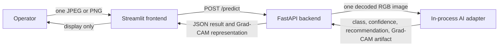

# SteelGuard AI Project Plan

> **Project:** SteelGuard AI — Intelligent Steel Surface Defect Detection for Smart Manufacturing
>
> **Document status:** Approved direction; preliminary MVP implementation is planned
>
> **Repository status:** Frontend mock MVP and Phase 1 dummy backend complete; real AI implementation remains planned

The preliminary competition MVP has one non-negotiable product boundary:

> **One user input → one AI inference → one AI output.**

The application must remain a focused operator tool, not a manufacturing
platform or analytics dashboard. Features outside this path belong to Future
Development and must not be added to the preliminary frontend.

## 1. Project Overview

SteelGuard AI is an AI-assisted steel surface inspection system intended to
classify a defect in one uploaded steel image, report the model's confidence,
show a Grad-CAM explanation, and present an `ACCEPT`, `REWORK`, or `REJECT`
recommendation to an operator.

The repository now contains a foundation, a working mock-driven frontend, and a
Phase 1 dummy backend:

- a runnable one-page Streamlit inspection workflow;
- implemented upload, Pillow validation, preview, loading, result, error,
  retry, reset, and responsive presentation components;
- a validated mock prediction service behind the future API client boundary;
- a FastAPI `/health` and `/predict` implementation with request validation,
  dummy adapter, tests, and Docker support;
- a stable prediction API contract and contract-shaped mock response;
- frontend and backend Dockerfiles with a health-checked two-service Compose
  foundation; and
- product, architecture, UI, and development documentation.

The trained model, real inference adapter, final live HTTP settings, and
Grad-CAM generation are planned work. The preliminary MVP is successful when
an operator can select one supported image, run one inference, view all four
backend-supplied outputs, recover from errors, and reset the interface for a
new independent image.

### Decision register

Items marked **Decision required** are intentionally unresolved. They must be
confirmed by the named role before the stated milestone; no implementer should
silently choose a value or policy.

| ID | Decision required | Accountable role | Required before |
| --- | --- | --- | --- |
| D-01 | Confirm dataset provenance and redistribution terms, split protocol, random seed, input dimensions, color handling, normalization, and training augmentation | AI lead | AI baseline training |
| D-02 | Select the deep-learning framework, pretrained-weight policy, final model-selection criteria, and measurable acceptance targets | AI lead and project lead | Final model selection |
| D-03 | Approve the business rules that map model output to `ACCEPT`, `REWORK`, or `REJECT` | Quality/domain owner | Backend–AI integration |
| D-04 | Set the maximum upload size and frontend/backend connection and inference timeouts | Backend and frontend leads | API integration |
| D-05 | Confirm base64 data URI or image-reference Grad-CAM transport; if a reference is selected, define lifetime and cleanup | Frontend and backend leads | API integration |
| D-06 | Confirm model artifact distribution, supported demo hardware, deployment target, ASGI runtime, and deployed CORS origins | Technical lead | Container integration |
| D-07 | Set calendar dates, named assignees, pull-request approvals, branch protection, and merge policy | Project lead | Team execution |

## 2. Background

Steel surface inspection is an important quality-control activity. A visual
inspection process depends on an operator noticing a defect, interpreting its
appearance consistently, and communicating the finding quickly enough for an
appropriate production decision. Repetition, difficult visual patterns, and
variation between operators can make that process inconsistent.

Computer vision and deep learning can provide repeatable image-based decision
support. SteelGuard AI uses the NEU Surface Defect Database as the project
dataset and works with the following six-class label contract:

1. `Crazing`
2. `Inclusion`
3. `Patches`
4. `Pitted Surface`
5. `Rolled-in Scale`
6. `Scratches`

This project does not assume that a research dataset fully represents every
factory, steel grade, finish, camera, or lighting condition. Deployment claims
must remain limited to the evidence produced by the confirmed evaluation
protocol.

## 3. Problem Statement

Manual steel surface inspection is vulnerable to:

- human error when subtle or visually similar defects are assessed;
- operator fatigue during repetitive inspection work;
- inconsistent results between operators, shifts, or inspection conditions;
  and
- delayed defect detection and delayed quality feedback.

The project needs a reproducible way to analyze one steel surface image and
return an understandable result without asking the frontend to perform AI or
quality-decision logic. The system must also fail clearly: it must never show a
plausible-looking fallback prediction when input validation, model inference,
or Grad-CAM generation fails.

## 4. Target Users

### Primary users

- **Inspection operators and quality-control personnel:** submit a steel
  surface image and review the classification, confidence, explanation, and
  recommendation during the competition demonstration.

### Supporting stakeholders

- **Quality and process engineers:** review class definitions, model evidence,
  limitations, and the future recommendation policy.
- **AI/ML developers:** prepare the dataset, compare candidate models, package
  the selected artifact, and maintain the inference adapter.
- **Frontend and backend developers:** deliver the user interaction and stable
  service boundary without duplicating AI decisions.
- **Project and competition leads:** control scope, coordinate milestones, and
  verify demonstration readiness.

The preliminary MVP is not designed for administrators, account managers,
data analysts, or factory-system integrators because their workflows are
outside the competition scope.

## 5. Proposed Solution

SteelGuard AI will provide a single-purpose Streamlit interface connected to a
FastAPI backend. The backend will validate one image and invoke an in-process,
framework-independent AI adapter once. The AI subsystem will preprocess the
image, run the selected model, map its output to one supported class, produce
a confidence value, generate a Grad-CAM artifact, and return the approved
quality recommendation. FastAPI will validate and serialize the result, make
the Grad-CAM artifact retrievable, and return the response to Streamlit.

The frontend will present the returned values without calculating, replacing,
or reinterpreting them. Grad-CAM will be described as a model explanation, not
as a segmentation mask or a precise defect boundary. The recommendation will
be presented as decision support for the operator; it will not directly
control manufacturing equipment.

## 6. Business Value

The preliminary MVP is intended to demonstrate qualitative value through:

- more consistent image assessment from a fixed, versioned model;
- quicker presentation of classification feedback after an image is supplied;
- visible model evidence through Grad-CAM to support review and discussion;
- a clear recommendation display once domain-approved rules exist;
- reproducible demonstrations across team environments through containers;
  and
- a modular foundation that can be evaluated before broader factory
  capabilities are considered.

These are intended benefits, not guaranteed production outcomes. No accuracy,
throughput, cost saving, return-on-investment, or defect-reduction claim will
be made until it is supported by measured evidence from an approved evaluation
or pilot.

## 7. MVP Scope

### User interaction

- Provide one focused Streamlit page with no dashboard navigation or login.
- Allow exactly one JPEG or PNG image to be selected at a time.
- Decode the selection for early usability validation and show an image
  preview before analysis.
- Enable Analyze only when one valid image is ready and prevent concurrent
  duplicate submission.
- Preserve the selected image after a recoverable request error so the operator
  can retry.
- Provide an **Analyze another image** action that clears all request-specific
  state.

### Inference and output

- Send the original selected file in one synchronous request to
  `POST /predict`.
- Perform exactly one model inference for the request.
- Return one of the six exact class labels.
- Return one finite confidence value in the inclusive range `0.0` to `1.0`.
- Return one Grad-CAM representation generated for the same inference.
- Return one recommendation from `ACCEPT`, `REWORK`, or `REJECT` after D-03 is
  approved.
- Display all output values from the same validated backend response.

### Operational scope

- Run the frontend and backend locally with documented Python and Docker
  workflows.
- Load the model once per backend process where practical rather than once per
  request.
- Use only request/demo-scoped temporary handling when a Grad-CAM artifact must
  be served.
- Keep the current interaction in Streamlit session state only; do not create
  inspection history or persistent result storage.

## 8. Out-of-Scope Features

The following features must not be implemented in the preliminary MVP:

- authentication, login, registration, authorization, or user accounts;
- inspection history, saved reports, persistent user sessions, or audit
  dashboards;
- advanced analytics, trend dashboards, reporting suites, or predictive
  analytics;
- batch inference, multi-image upload, or multi-image inference;
- real-time camera, video, or production-line stream ingestion;
- Manufacturing Execution System (MES) integration;
- Industrial Internet of Things (IIoT) integration;
- Digital Twin functionality;
- automated storage or logging of submitted images and prediction results;
- production databases, distributed storage, message brokers, background jobs,
  or task queues;
- automated manufacturing control or rejection actuation; and
- frontend classification, confidence scoring, Grad-CAM generation,
  recommendation thresholds, or fallback predictions.

An out-of-scope request must be recorded as a Future Development candidate. It
must not be merged into the preliminary MVP merely because the existing
architecture could later support it.

## 9. Future Development

Future capabilities may be considered only after the preliminary MVP meets its
Definition of Done and the additional work receives separate approval.

| Area | Candidate future capabilities | New concerns that must be addressed |
| --- | --- | --- |
| Identity and governance | Authentication, user accounts, roles, permissions, audit trails | Security model, privacy, account lifecycle, access review |
| Records and reporting | Inspection history, saved reports, search, advanced analytics | Data ownership, retention, database design, reporting definitions |
| Scaled ingestion | Batch inference, multi-image jobs, real-time camera or video | Queues, throughput, backpressure, camera calibration, failure recovery |
| Factory integration | MES and IIoT connectivity | Protocols, equipment safety, network boundaries, operational ownership |
| Advanced intelligence | Predictive analytics and Digital Twin capabilities | Additional datasets, causal validity, synchronization, model monitoring |
| Platform operations | Distributed storage, background processing, automated result logging | Infrastructure, observability, cost, resilience, governance |

Listing a capability here does not commit the project to building it and does
not authorize preliminary MVP code for it.

## 10. System Workflow

```text
Steel image
→ image preprocessing
→ AI model
→ defect classification
→ confidence score
→ Grad-CAM
→ Accept / Rework / Reject recommendation
→ operator interface
```

The end-to-end interaction is:

1. The operator selects one JPEG or PNG file in Streamlit.
2. The frontend verifies that Pillow can decode the image, normalizes its
   orientation for preview only, and keeps the original upload bytes intact.
3. The frontend displays the preview and enables Analyze.
4. Analyze sends the original file once in the multipart `file` field.
5. FastAPI performs authoritative type, cardinality, content, and decode
   validation.
6. The backend invokes the AI adapter once with one decoded RGB image.
7. The adapter preprocesses the image and returns classification, confidence,
   recommendation, and a Grad-CAM artifact from the same inference.
8. The backend validates the logical result, packages the Grad-CAM using the
   confirmed transport, and serializes the API response.
9. The frontend validates the response shape and displays the result or a
   recoverable error.
10. **Analyze another image** returns the application to a clean Idle state.

The UI state sequence is `EMPTY → IMAGE_SELECTED → ANALYZING → SUCCESS` or
`EMPTY → IMAGE_SELECTED → ANALYZING → ERROR`. A service error can return to
`IMAGE_SELECTED` for a retry; success or an explicit reset returns to `EMPTY`.

## 11. System Architecture



### Architecture boundaries

- **Streamlit** owns presentation and the current interaction state.
- **FastAPI** owns the public HTTP contract, authoritative request validation,
  AI orchestration, response validation, and Grad-CAM delivery.
- **The AI adapter** owns preprocessing, model lifecycle, label mapping,
  confidence, Grad-CAM generation, and recommendation policy.
- **No database** is required or permitted for the preliminary workflow.
- The AI adapter executes in or is imported by the backend process. It is not a
  separate network microservice for the MVP.

### Current and target state

| Subsystem | Current repository state | Preliminary MVP target |
| --- | --- | --- |
| Frontend | Complete one-image state flow with mock and configurable live API client | Use the contract-defined live API with the real AI adapter |
| Backend | Runnable FastAPI Phase 1 dummy prediction service with validation and tests | Replace the dummy adapter with the real AI adapter |
| AI | Responsibility documentation only | Reproducible trained artifact and single-image adapter |
| Containers | Frontend and backend Dockerfiles with two-service Compose | Healthy frontend and backend services with model access |

## 12. Technology Stack

| Layer | Technology | Status and purpose |
| --- | --- | --- |
| Language/runtime | Python 3.11 | Current frontend container baseline; backend and AI environments must remain compatible |
| Frontend | Streamlit | Current dependency and implemented single-image operator interface |
| Frontend HTTP and imaging | Requests and Pillow | Configurable mock/real API boundary; Phase 2 dummy endpoint smoke-tested |
| Backend | FastAPI | Implemented contract-defined inference API and validation boundary; real AI remains pending |
| AI models | CNN, MobileNetV2, EfficientNetB0, ResNet50 | Candidate architectures; final selection is D-02 |
| AI framework | To be confirmed | D-02; framework tensors must remain behind the adapter |
| Dataset | NEU Surface Defect Database | Supplied six-class project dataset; governance and preparation details are D-01 |
| Explainability | Grad-CAM | Planned explanation for the same classification inference |
| Testing | Python unittest, Streamlit AppTest, and backend pytest | Frontend and Phase 1 backend checks; AI/model-quality checks remain planned |
| Containers | Docker and Docker Compose | Current frontend container foundation; target local two-service startup |
| Source control | Git with Conventional Commits | Current repository history and planned team workflow |

The exact FastAPI ASGI runtime, model artifact packaging method, and supported
hardware profile are part of D-06.

## 13. Frontend Responsibilities

The Streamlit frontend must:

- compose the EMPTY, IMAGE_SELECTED, ANALYZING, SUCCESS, and ERROR states in `app.py`;
- accept exactly one JPEG or PNG selection and provide concise validation
  feedback;
- preview a decodable image without modifying the original bytes sent to the
  backend;
- make one synchronous call through `services/api_client.py` using the
  configured `STEELGUARD_API_BASE_URL`;
- prevent analysis without valid input and prevent duplicate submission while
  a request is active;
- handle connection, timeout, non-success, non-JSON, and contract-invalid
  responses as recoverable errors;
- render the exact backend class and recommendation, format the backend
  confidence accessibly as a percentage, and resolve the backend Grad-CAM
  reference;
- use text as well as color for recommendation status and label Grad-CAM as a
  model explanation;
- retain only current-interaction state in Streamlit session state; and
- clear the selected image, result, error, and request state on reset.

Presentation components must not make HTTP requests. The frontend must not
contain model code, class lookup logic, confidence thresholds, recommendation
rules, heatmap generation, or automatic fallback from a failed live request to
the mock response.

## 14. Backend Responsibilities

The FastAPI backend must:

- implement `POST /predict` according to
  [`API_CONTRACT.md`](API_CONTRACT.md);
- accept exactly one multipart field named `file` and reject missing,
  repeated, unsupported, corrupt, or otherwise invalid content;
- inspect decoded content rather than trusting only the filename or supplied
  media type;
- decode one image to the AI adapter's agreed RGB representation and invoke the
  adapter exactly once;
- load and retain the required model artifact at process startup where
  practical, and fail clearly when it is unavailable;
- validate class membership, confidence finiteness and bounds,
  recommendation membership, and Grad-CAM availability before returning
  success;
- turn the adapter's Grad-CAM artifact into the confirmed transport
  representation according to D-05;
- return stable HTTP statuses and concise, non-sensitive error messages without
  fake prediction data;
- configure CORS only for confirmed deployed frontend origins when the
  services use different origins; and
- expose runtime health suitable for container orchestration once the health
  mechanism is confirmed under D-06.

The backend transports the AI result. It must not reclassify an image,
synthesize a confidence score, or invent a recommendation after an AI failure.
It must not persist images or results as inspection history.

## 15. AI/ML Responsibilities

### Dataset and experiment preparation

The AI workstream must:

- document the dataset source, permitted use, local acquisition steps, and
  redistribution constraints without committing dataset files to Git;
- lock the exact case-sensitive label-to-index mapping;
- define reproducible training, validation, and held-out test partitions;
- prevent duplicate or related-image leakage across partitions;
- record the random seed and all preprocessing parameters;
- apply training augmentation only where documented and appropriate; and
- keep the held-out evaluation data isolated from model and threshold choices.

> **Decision required D-01:** The AI lead must approve data provenance,
> splitting, preprocessing, normalization, and augmentation before baseline
> training begins.

### Model development and selection

- Establish a simple CNN baseline.
- Evaluate MobileNetV2, EfficientNetB0, and ResNet50 under the same confirmed
  split and reporting protocol.
- Record training configuration, dependency versions, model source or
  pretrained-weight source, random seed, and artifact checksum.
- Compare models using the confirmed acceptance criteria and operational
  constraints rather than selecting from a single headline metric.
- Report per-class behavior, a confusion matrix, macro-averaged results, and
  known limitations without presenting unconfirmed targets as achievements.

> **Decision required D-02:** The AI lead and project lead must confirm the
> framework, pretrained-weight policy, selection criteria, acceptance targets,
> and final architecture. This document intentionally selects none of the four
> candidates in advance.

### Inference adapter

Expose a framework-independent boundary equivalent to:

```text
predict(decoded_rgb_image) -> {
    class_name,
    confidence,
    recommendation,
    gradcam_artifact
}
```

The adapter must:

- reproduce the selected model's training-time preprocessing;
- return one exact supported label and one finite confidence in `[0.0, 1.0]`;
- document how confidence is calculated and evaluate whether calibration is
  required;
- generate Grad-CAM from the same inference and align its visualization with
  the submitted image;
- return one domain-approved recommendation; and
- raise explicit, testable failures for invalid input, missing artifacts,
  inference errors, and explanation errors.

> **Decision required D-03:** The project output classes identify defect
> categories, but they do not by themselves define manufacturing disposition.
> A quality/domain owner must approve the recommendation rules and any use of
> class, confidence, or other evidence before `ACCEPT`, `REWORK`, or `REJECT`
> is enabled in live inference.

## 16. Integration Strategy

Integration will be contract-first so the three workstreams can progress
independently:

1. **Frontend against fixture:** implement and test the UI using
   [`mock/prediction_response.json`](../mock/prediction_response.json). Mock
   mode must be explicit and must never activate automatically after a live
   failure.
2. **Backend against test double:** implement transport, validation, error
   mapping, and Grad-CAM delivery using a deterministic AI adapter
   double.
3. **AI behind the adapter:** develop the model without importing Streamlit or
   exposing framework tensors to FastAPI.
4. **Contract integration:** connect the real adapter to FastAPI, then connect
   Streamlit to the configured backend URL.
5. **End-to-end hardening:** exercise supported classes, invalid inputs,
   unavailable artifacts, request failures, reset behavior, and clean-machine
   container startup.

The frontend sends original upload bytes; it does not send its preview image.
The backend owns transport validation, while the adapter owns model-specific
preprocessing. Each response must represent one logical inference.

Any API field, enum, path, or semantic change must update the API contract,
mock fixture, backend schema, frontend response validation, relevant tests, and
[`DEVELOPMENT_LOG.md`](DEVELOPMENT_LOG.md) in the same pull request. A breaking
change requires an explicitly coordinated contract revision.

## 17. API Strategy

The preliminary MVP exposes one prediction operation:

```text
POST /predict
Content-Type: multipart/form-data
Field: file (exactly one JPEG or PNG file)
```

### Successful response contract

| Field | Type | Rule |
| --- | --- | --- |
| `success` | boolean | Must be `true` for a successful prediction |
| `prediction.class_name` | string | One exact supported class label |
| `prediction.confidence` | number | Finite value from `0.0` through `1.0` |
| `prediction.recommendation` | string | `ACCEPT`, `REWORK`, or `REJECT` |
| `prediction.gradcam_image` | string or null | `null` during dummy integration; non-empty confirmed base64 or image-reference transport for live inference |

The API contract recommends a PNG data URI containing base64-encoded bytes for
the local Docker Compose MVP, but D-05 remains open until the frontend and
backend teams confirm it. If an image reference is chosen instead, its URL must
be reachable and its lifetime documented.

### Error strategy

Errors use the stable `success: false` and `error.code`/`error.message`
envelope and never contain a fallback prediction.

| Status | Situation |
| --- | --- |
| `400 Bad Request` | Repeated file field, corrupt image, or otherwise invalid request content |
| `415 Unsupported Media Type` | Content is not a supported JPEG or PNG image |
| `422 Unprocessable Entity` | Required `file` field is missing or malformed |
| `503 Service Unavailable` | The model, inference, AI output, or Grad-CAM generation is unavailable or failed |
| `500 Internal Server Error` | An unexpected backend failure occurred outside recognized validation and inference cases |

> **Decision required D-04:** Set one upload-size limit and compatible
> connection/read/inference timeouts. The frontend may provide early feedback,
> but the backend limit is authoritative and both layers must use consistent
> wording.

> **Decision required D-05:** Confirm the API contract's recommended base64 PNG
> data URI or choose an image endpoint/generated-file reference. If a reference
> is selected, define reachability, expiry, and cleanup. Neither option may
> become result history.

The complete HTTP source of truth remains
[`API_CONTRACT.md`](API_CONTRACT.md). The project plan summarizes that contract
but does not supersede it.

## 18. Testing Strategy

Testing must cover the behavior of each boundary and the complete operator
journey.

| Test level | Required coverage |
| --- | --- |
| Frontend unit/component | File validation, orientation-safe preview, state transitions, disabled duplicate submission, confidence formatting, recommendation text, Grad-CAM resolution, reset behavior |
| API client | Multipart field and original bytes, base URL configuration, timeout/connection errors, non-success statuses, invalid JSON, missing or invalid response fields |
| Backend unit/API | Missing/repeated files, content-type and decoded-content validation, adapter invocation count, output schema validation, every documented status, safe error messages, Grad-CAM retrieval |
| AI unit | Label map, deterministic preprocessing, expected input shape, finite confidence bounds, supported recommendation, Grad-CAM generation, missing-artifact and inference failures |
| Model evaluation | Locked held-out split, per-class precision and recall, per-class and macro F1, confusion matrix, confidence/calibration analysis, documented failure examples and limitations |
| Contract/integration | Mock fixture and schema agreement, test-double adapter, real adapter response, confirmed Grad-CAM representation, frontend-to-backend request flow |
| End-to-end | Valid JPEG and PNG, representative output for each contract label, retry after recoverable failure, reset to a clean second interaction, no fabricated results |
| Container/reproducibility | Clean builds, service startup, health behavior, environment configuration, model availability, restart behavior, documented local commands |
| Operator acceptance | One-image workflow clarity, accessible statuses, understandable error recovery, visible explanation labeling, confirmed recommendation wording |

Automated tests should use small fixtures or generated test images that may be
legally stored in the repository. Full training data and large model artifacts
must stay outside Git. Test doubles must be unmistakable and must not be used
as evidence of model quality.

> **Decision required D-02:** Numeric model-quality, confidence-calibration,
> latency, and resource acceptance targets must be approved before final model
> evaluation. Until then, tests may verify correctness and report measurements
> but must not claim that an unspecified target was met.

## 19. Docker and Local Reproducibility Strategy

### Current foundation

- `frontend/Dockerfile` uses Python 3.11, installs the current frontend
  requirements, runs as a non-root user, and defines a Streamlit health check.
- `docker-compose.yml` currently builds and exposes only the frontend on port
  `8501`.
- The backend container, AI dependencies, and model artifact delivery do not
  yet exist.

### Preliminary MVP target

- Add a backend Dockerfile only after the FastAPI application and dependency
  definition exist.
- Run FastAPI and the in-process AI adapter as one backend service listening on
  the documented backend port.
- Configure the frontend in Compose with
  `STEELGUARD_API_BASE_URL=http://backend:8000`; do not hard-code service URLs
  in presentation components.
- Start the frontend only when the backend health mechanism indicates that its
  required runtime and model are available.
- Preserve non-root execution, explicit health checks, deterministic
  dependencies, and concise startup failures.
- Keep secrets and machine-specific values outside the image; document safe
  configuration in an `.env.example` if configuration is introduced.
- Do not add persistent volumes for uploaded images, predictions, or Grad-CAM
  history.
- Support a documented CPU-compatible demonstration path. Hardware
  acceleration may be optional after the target environment is confirmed.
- Verify the target workflow from a clean checkout with
  `docker compose up --build` and no manual source changes.

The selected model artifact must have a recorded version and checksum. Startup
must fail clearly if the expected artifact is absent or does not match the
documented version.

> **Decision required D-06:** Confirm whether the model is mounted, downloaded
> through an explicit setup step, or included in a controlled image; also
> confirm the ASGI runtime, host port exposure, target CPU/GPU and memory,
> deployed origins, and deployment environment before container integration.

## 20. Git Workflow

The recommended team workflow is:

1. Keep `main` in a reviewable, runnable state.
2. Create a short-lived branch for one coherent change, using names such as
   `feat/frontend-upload`, `feat/backend-predict`, `feat/ai-adapter`,
   `fix/api-validation`, or `docs/project-plan`.
3. Keep commits focused and use the Conventional Commit rules below.
4. Reconcile the branch with the latest `main`, then run all validation relevant
   to the changed subsystem.
5. Open a pull request that states scope, contract impact, validation evidence,
   screenshots for UI changes, and any unresolved risk.
6. Require cross-workstream review when a change affects the API, adapter,
   label map, recommendation, Docker integration, or MVP scope.
7. Merge only after required checks and reviews pass; remove the short-lived
   branch after merge.

Never commit credentials, `.env` files, the NEU dataset, uploads, predictions,
generated Grad-CAM output, logs, or large model artifacts. Use versioned
metadata and checksums in Git while storing model artifacts through the
confirmed D-06 mechanism.

> **Decision required D-07:** The project lead must configure the required
> approval count, protected-branch rules, required checks, merge method, branch
> deletion policy, calendar schedule, and named assignees. The workflow above
> is the default process until repository-host settings are confirmed.

## 21. Conventional Commit Strategy

Use this format:

```text
type(scope): imperative lowercase description
```

### Types

- `feat`: new user-facing or subsystem capability
- `fix`: defect correction
- `docs`: documentation-only change
- `test`: test-only change
- `refactor`: internal change without intended behavior change
- `build`: dependency or container build change
- `ci`: continuous-integration configuration
- `perf`: measured performance improvement without a contract change
- `chore`: repository maintenance

Recommended scopes are `frontend`, `backend`, `ai`, `api`, `docker`, and
`docs`. Omit the scope only when a change genuinely spans the repository.

Examples:

```text
feat(frontend): add single-image upload and preview
feat(backend): expose prediction endpoint
test(ai): cover supported defect labels
fix(frontend): preserve selected image after api error
docs(api): clarify grad-cam resource lifetime
build(docker): add backend service image
```

Keep the subject concise, imperative, lowercase, and without a trailing period.
Use the commit body for rationale and validation. Use a footer such as
`BREAKING CHANGE:` only when a deliberately versioned incompatible change is
introduced. One commit should not mix unrelated formatting, model, API, and UI
work.

## 22. Development Milestones

Milestones are ordered by dependency, not by unconfirmed calendar dates.
Frontend, backend, and AI work may proceed in parallel after the API contract is
accepted, but end-to-end integration depends on all three boundaries.

| Phase | Status | Primary owner | Deliverable | Exit criteria |
| --- | --- | --- | --- | --- |
| 0. Foundation | Complete | Shared | Monorepo structure, readiness page, docs, mock response, frontend container | Current Streamlit page starts; repository boundaries and API contract are documented |
| 1. Frontend MVP | Complete | Frontend | Upload, preview, Analyze, loading/error/success, mock result, Grad-CAM placeholder, retry, reset | Full state flow passes against the approved fixture; no AI output is derived in the frontend |
| 2. Backend API | Phase 1 complete | Backend | FastAPI request validation, prediction endpoint, dummy adapter, errors, container | API and negative-path tests conform to the Phase 1 contract |
| 3. AI baseline and selection | Planned | AI | Reproducible dataset protocol, candidate comparison, selected artifact, Grad-CAM, adapter | D-01 through D-03 are resolved; artifact evidence and adapter tests are complete |
| 4. Integration | Dummy path verified | Shared | Streamlit → FastAPI dummy path and two-service Compose | Real AI path and final timeout/Grad-CAM decisions remain before full MVP acceptance |
| 5. Demo hardening | Planned | Shared | Recovery behavior, operator guidance, reproducibility evidence, rehearsal | Clean-machine Docker rehearsal and Definition of Done review pass |

> **Decision required D-07:** Assign people and target dates after team capacity
> and the competition schedule are confirmed. Dates or names must not be
> inferred from repository structure.

## 23. Risks and Mitigation

| Risk | Potential effect | Mitigation |
| --- | --- | --- |
| Dataset provenance or redistribution uncertainty | Non-reproducible or non-compliant data use | Resolve D-01, document acquisition and permissions, keep dataset files outside Git |
| Dataset-to-factory domain shift | Demonstration results may not generalize to production images | State limitations, test representative external images only when authorized, require a future site-specific pilot |
| Data leakage or overfitting | Misleading evaluation | Freeze deterministic partitions, check duplicates/related images, isolate held-out data, record experiment provenance |
| Visually similar classes | Unstable per-class behavior | Review confusion matrix and per-class metrics, inspect errors, avoid relying on aggregate metrics alone |
| Undefined recommendation semantics | Unsafe or arbitrary disposition advice | Resolve D-03 with a quality/domain owner; never infer rules in frontend or transport code |
| Misinterpreted confidence | Operators may treat a score as certainty | Document its calculation and calibration evidence; label it clearly; do not invent thresholds |
| Misinterpreted Grad-CAM | Heatmap may be treated as a defect boundary or proof | Label it as model explanation, test alignment, document limitations, never call it segmentation |
| Model artifact or label-map mismatch | Incorrect classifications or startup failure | Version and checksum artifacts, validate label maps, fail fast at startup, test packaged deployment |
| Contract drift between teams | Broken integration or altered outputs | Contract-first tests and atomic updates to contract, fixture, clients, schemas, tests, and log |
| Invalid, corrupt, or oversized input | Errors or resource exhaustion | Decode authoritatively, enforce D-04 limits, return safe errors, add negative and resource tests |
| Inference too slow or resource-heavy for demo hardware | Timeouts or failed demonstration | Compare candidates under D-06 hardware assumptions, document measurements, rehearse CPU path |
| Grad-CAM transport failure or leakage | Undisplayable output or unintended retention of user-derived artifacts | Resolve D-05; validate base64 output or use short-lived storage with deterministic cleanup; add transport tests |
| Demo service failure | Interrupted competition workflow | Health checks, clear startup errors, clean-machine rehearsal, documented recovery steps |
| Scope creep | Core path remains incomplete or unreliable | Enforce Sections 7–9 in reviews and defer expansion work until the MVP is done |

Risk owners are the corresponding workstream leads until named assignees are
confirmed under D-07.

## 24. Definition of Done

The preliminary MVP is done only when all of the following are true.

### Product behavior

- One JPEG or PNG can be selected, validated for preview, analyzed once, and
  reset.
- Analyze is unavailable without valid input and cannot be double-submitted.
- A successful result shows one supported class, the backend confidence, one
  approved recommendation, and one Grad-CAM explanation from the same response.
- Error states are concise and recoverable and never fabricate a prediction.
- The frontend contains no inference, threshold, recommendation, or heatmap
  generation logic.

### API and AI evidence

- `POST /predict` and every documented error conform to the API contract.
- The backend validates input and adapter output and invokes the adapter once.
- D-01 through D-06 are resolved and documented.
- The selected model artifact, checksum, label map, preprocessing, framework,
  environment, evaluation protocol, measured results, and known limitations
  are recorded.
- The selected model meets the approved D-02 targets; no target or result is
  invented for this document.
- Grad-CAM is generated for the same inference and is retrievable for its
  confirmed lifecycle.

### Quality and reproducibility

- Relevant frontend, backend, AI, contract, integration, end-to-end, and
  container tests pass.
- A clean checkout starts the target frontend and backend with
  `docker compose up --build` on the documented supported environment without
  source edits.
- An operator can complete the primary journey and recover from tested failure
  scenarios using the documented instructions.
- API, architecture, feature, frontend, UI-flow, README, and development-log
  documentation agree with the implemented behavior.
- No secrets, dataset files, user uploads, generated predictions, Grad-CAM
  history, or large model artifacts are committed to Git.
- None of the Section 8 exclusions is present in the preliminary MVP.

## 25. Final-stage Expansion Strategy

Expansion begins only after the preliminary MVP is accepted. The project must
not add speculative infrastructure to the MVP solely to prepare for these
stages.

1. **Core hardening:** validate with authorized, production-representative
   images; improve calibration, security, model monitoring, deployment
   reliability, and documented operational support.
2. **Identity and governed records:** design authentication, user roles,
   inspection history, auditability, reporting, privacy, and retention as one
   approved product increment.
3. **Scaled ingestion:** introduce batch inference or real-time camera/video
   only with queueing, throughput, backpressure, calibration, storage, and
   recovery designs.
4. **Factory connectivity:** integrate MES or IIoT only after protocols,
   network boundaries, safety ownership, failure behavior, and read/write
   authority are approved.
5. **Advanced intelligence:** consider advanced analytics, predictive
   analytics, or Digital Twin functionality only when additional data,
   validation, synchronization, and governance requirements are established.

Every expansion stage requires its own approved scope, architecture, threat
model, data-governance plan, API contracts, tests, rollout and rollback plan,
monitoring, and Definition of Done. None is part of the preliminary competition
MVP.
