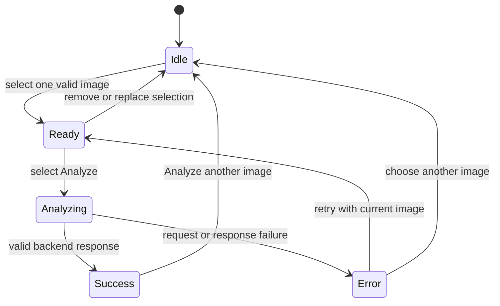

# UI Flow

## Primary journey

The application is a single-purpose interaction, not a dashboard. The page
should keep the primary action and current state obvious at every step.

## State behavior

| State | Visible content | Available actions |
| --- | --- | --- |
| Idle | Project heading, concise instruction, one-image uploader | Select one JPEG or PNG |
| Ready | Selected image preview and enabled Analyze button | Analyze, replace, or remove image |
| Analyzing | Preview, progress indicator, disabled duplicate submission | Wait for completion |
| Success | Preview, defect class, confidence, recommendation, Grad-CAM | Analyze another image |
| Error | Preview when available and a concise recoverable error | Retry or choose another image |

## Interaction rules

1. The uploader accepts one file only. It must not present multi-select or
   batch behavior.
2. The image is decoded before preview. Invalid or unsupported content keeps
   the page out of the Ready state.
3. Analyze is disabled until one valid image exists.
4. While a request is in progress, the UI prevents a second submission.
5. A success state is shown only after all required response fields pass
   contract validation.
6. Classification, confidence, recommendation, and Grad-CAM are displayed from
   the same response; none is inferred from another field.
7. "Analyze another image" clears the uploader, preview, result, error, and any
   request-specific state.

## Error behavior

- Use plain-language messages for unsupported or unreadable files, connection
  failures, timeouts, server errors, and invalid response data.
- Preserve the selected image after a recoverable API error so the user can
  retry without selecting it again.
- Do not expose stack traces, filesystem paths, model internals, or raw server
  exception text in the competition UI.
- Do not substitute the mock response automatically after a live request fails.

## Result presentation

- Show the defect class as the primary textual result.
- Format confidence as an accessible percentage while retaining the numeric
  value returned by the backend.
- Present the recommendation with text in addition to color; color alone must
  not communicate ACCEPT, REWORK, or REJECT.
- Label Grad-CAM as a model explanation and avoid presenting it as a precise
  defect boundary or segmentation mask.

## Accessibility and responsiveness

- Every image needs meaningful alternative text or a visible caption.
- Controls need explicit labels and keyboard operation.
- Loading and error states must be announced through Streamlit status elements.
- The layout should remain readable on a typical laptop and a narrow mobile
  viewport without adding a dashboard navigation shell.
